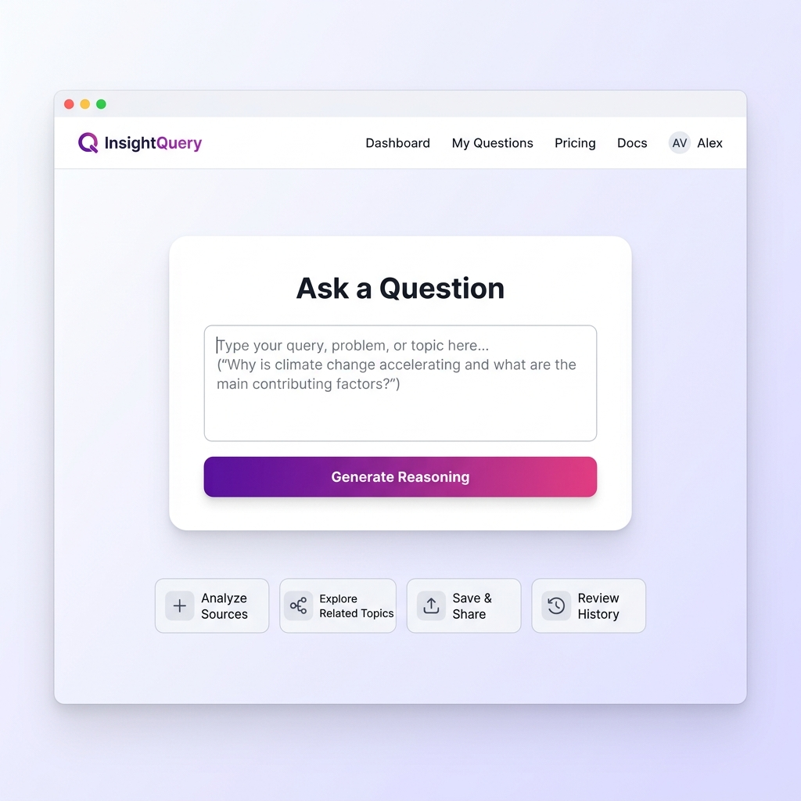
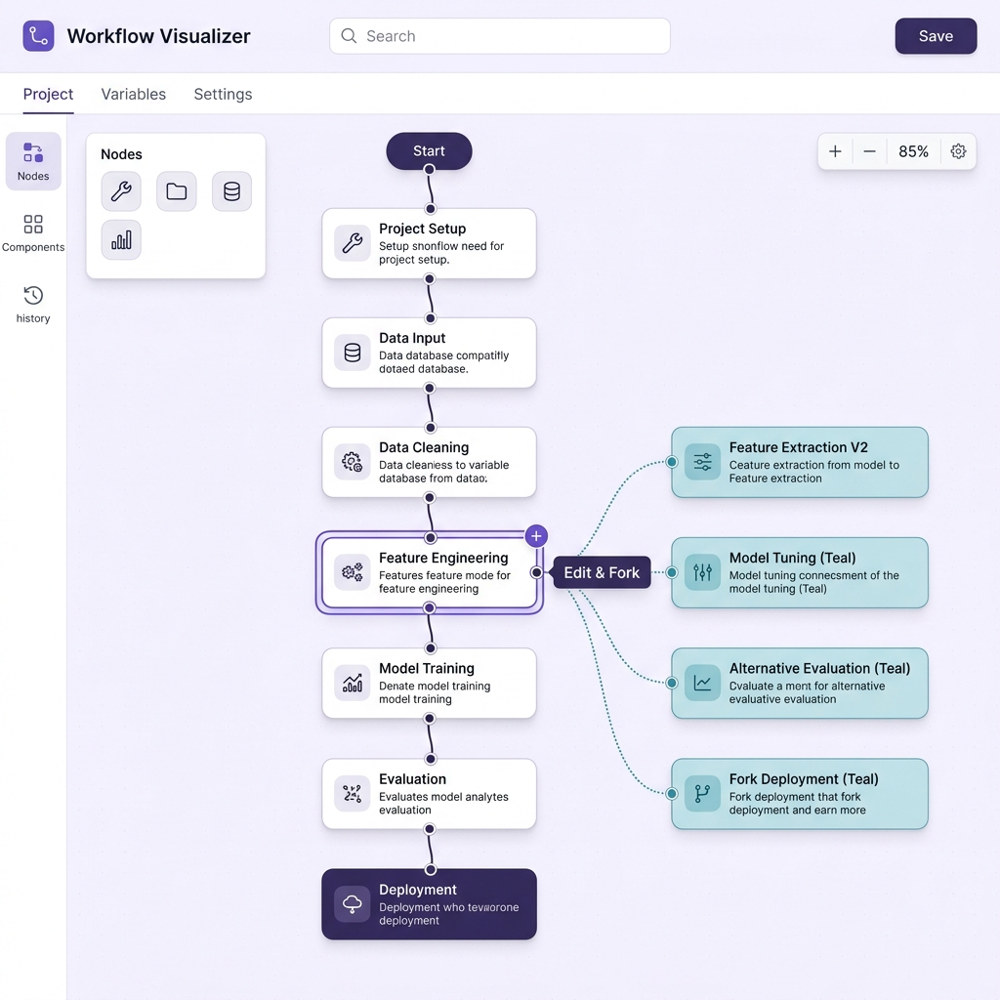

<p align="center">
  <h1 align="center">WhatIfGPT</h1>
  <p align="center"><strong>"Don't just read reasoning — fork it, edit it, and watch the answer change."</strong></p>
</p>

<p align="center">
  
  
  
  
  
</p>

<p align="center">
  
</p>

<!-- 
  📷 IMAGE PLACEHOLDER: Please add your banner image to the /docs folder as 'thumbnail.png'.
  This represents the interactive, sky-blue decision tree visual for the project.
-->

---

## What is WhatIfGPT?

**WhatIfGPT** is an interactive AI reasoning explorer that turns complex GPT-OSS/LLM chain-of-thought steps into an editable, forkable tree. Unlike traditional chatbots that present reasoning as a static wall of text, WhatIfGPT exposes the underlying reasoning path as a dynamic visual graph. This enables you to click into any individual step, modify assumptions or facts, and immediately watch how those edits ripple through subsequent steps to synthesize an entirely new answer. It turns passive AI consumption into an active, iterative sandbox for decision-making and deep exploration.

---

## Features

- 🌳 **Interactive Reasoning Tree**: Visualize the AI's step-by-step thinking as a clean, navigable graph using React Flow.
- 🔀 **Fork & Edit Any Step**: Click on any reasoning node to edit its text, adjust variables, and fork a new path to test different scenarios.
- 💡 **AI Next-Step Suggestions**: Get context-aware, intelligent suggestions of alternative pathways to explore next.
- ⚖️ **Branch Comparison**: Compare two different reasoning paths side-by-side to understand exactly how changed inputs altered the final output.
- 📄 **Dedicated Final Report**: View a beautifully formatted, distraction-free document consolidating your customized reasoning chain.
- ✨ **Premium Markdown Formatting**: Enjoy elegant Markdown rendering (headers, bold text, lists) within generated reports and steps.
- 📋 **One-Click Copy**: Instantly copy the fully synthesized final report to your clipboard for sharing.
- 🎨 **Glassmorphism UI**: Beautifully designed modern frosted-glass interface with subtle animated gradients and background blur.

---

## Demo

<p align="center">
  
</p>

<p align="center">
  <em>The WhatIfGPT interface showing a question being asked, the resulting interactive reasoning tree, and the ability to click, fork, and edit individual nodes.</em>
</p>

<!-- 
  📷 IMAGE PLACEHOLDER: Please add your screenshots to the /docs folder:
  - 'screenshot-1.png' showing the "Ask a Question" home screen or reasoning tree in action.
  - 'screenshot-2.png' showing other features like the comparison view or node editor.
-->

<p align="center">
  
</p>

---

## Tech Stack

| Layer | Technology |
| :--- | :--- |
| **Frontend** | React, Vite, Tailwind CSS, React Flow |
| **Backend** | FastAPI (Python) |
| **LLM** | gpt-oss via Groq API / GPT-5.6 via Codex |
| **Styling** | Custom glassmorphism CSS with backdrop blur |

---

## Getting Started

### Prerequisites

Before running the application, make sure you have:
- **Node.js** (v16 or higher)
- **Python** (v3.9 or higher)
- A free **Groq API key** (available from [console.groq.com](https://console.groq.com))

### Installation

1. **Clone the repository**
   ```bash
   git clone https://github.com/subhashdoc234xyz/WhatIfGPT.git
   cd WhatIfGPT
   ```

2. **Set up environment variables**
   Copy the example environment file and configure your API key:
   ```bash
   cp .env.example .env
   # Edit .env and enter your GROQ_API_KEY
   ```

3. **Install dependencies**
   Install root, frontend, and backend packages:
   ```bash
   # From root directory to install root helper dependencies
   npm install

   # Install frontend dependencies
   cd frontend
   npm install

   # Install backend dependencies
   cd ../backend
   pip install -r requirements.txt
   ```

### Running the Application

To run the application locally, start both the FastAPI backend and Vite development server.

1. **Start the Backend server**
   ```bash
   cd backend
   uvicorn main:app --reload --port 8000
   ```

2. **Start the Frontend client**
   ```bash
   cd frontend
   npm run dev
   ```

Once both servers are running, open your browser and navigate to **[http://localhost:5173](http://localhost:5173)**.

---

## Usage

1. **Ask a Question**: Enter a complex question or decision-making scenario in the main prompt box.
2. **Explore the Tree**: Examine the visualized steps as the LLM lays out its logical path.
3. **Fork and Modify**: Hover over or click on any step in the tree, select the edit option, change the logical assumptions, and hit save to fork a new logical branch.
4. **Compare Scenarios**: Select and compare branches to view differences in conclusions side-by-side.
5. **Synthesize and Export**: Click 'Finish' to compile the reasoning into a final report, copy it to your clipboard, and share it with others.

---

## Project Structure

```
WhatIfGPT/
├── backend/                 # FastAPI backend application
│   ├── main.py              # Application entrypoint & endpoints
│   ├── gpt_oss_client.py    # LLM & Groq client integration
│   ├── reasoning_parser.py  # Utilities to parse raw output into steps
│   └── requirements.txt     # Python backend dependencies
├── frontend/                # React Vite frontend application
│   ├── src/
│   │   ├── components/      # Modular UI components
│   │   │   ├── BranchCompare.jsx
│   │   │   ├── ConclusionView.jsx
│   │   │   ├── NodeEditor.jsx
│   │   │   ├── PromptInput.jsx
│   │   │   └── ReasoningTree.jsx
│   │   ├── App.jsx          # Main application wrapper
│   │   ├── index.css        # Glassmorphism & styling styles
│   │   └── main.jsx         # Frontend entrypoint
│   ├── index.html
│   └── package.json
├── docs/                    # Image assets for documentation
├── .env.example             # Configuration template
├── README.md                # Project documentation
└── LICENSE                  # License file
```

---

## API Endpoints

| Method | Endpoint | Description |
| :--- | :--- | :--- |
| **POST** | `/api/generate` | Generates initial structured reasoning steps from a user's prompt. |
| **POST** | `/api/fork` | Creates a new branch by editing or appending a reasoning step. |
| **POST** | `/api/compare` | Compares two logical branches and analyzes their key differences. |
| **POST** | `/api/suggestions` | Generates context-aware, alternative next steps to guide reasoning. |
| **POST** | `/api/finish` | Synthesizes a set of reasoning steps into a final cohesive conclusion. |
| **GET** | `/api/health` | Simple health check to verify backend operational status. |

---

## Deployment

### Backend (Render)
1. Set up a Web Service on Render pointing to your backend folder.
2. Ensure you add `GROQ_API_KEY` to the environment variables dashboard.
3. Configure the start command to run `uvicorn main:app --host 0.0.0.0 --port $PORT`.

### Frontend (Vercel / Render)
1. Connect your GitHub repository to Vercel or Render.
2. Configure build settings:
   - Build Command: `npm run build`
   - Output Directory: `dist`
3. Add the `VITE_API_URL` environment variable pointing to your deployed backend URL.

---

## Team

- **Subhash Boopathi**
- **SANJAI**
- **Rohith**
- **Sandhyarani Yarava**

---

## Hackathon

This project was built for the **OpenAI Build Week** (Codex + GPT-5.6) and originally prototyped for the **OpenAI Open Model Hackathon** (gpt-oss). By converting LLM chain-of-thought output into visual, interactive branches, WhatIfGPT demonstrates a new paradigm of human-AI collaboration where reasoning is no longer a static black-box output, but rather a dynamic, editable decision tree.

---

## License

This project is licensed under the MIT License - see the [LICENSE](LICENSE) file for details.

---

<p align="center">
  <em>Made with reasoning, forks, and a lot of coffee.</em>
</p>
